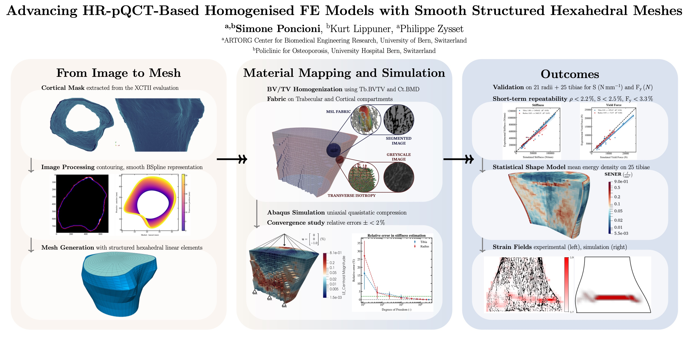

# Homogenised Finite Elements (HFE) pipeline

[](https://doi.org/10.5281/zenodo.13879889)

[](https://github.com/artorg-unibe-ch/HFE/actions/workflows/build-gcc.yml)
[](https://github.com/artorg-unibe-ch/HFE/actions/workflows/build-ifort.yml)
[](https://github.com/artorg-unibe-ch/HFE/actions/workflows/docs.yml)
[](https://github.com/artorg-unibe-ch/HFE/actions/workflows/todo_to_issue.yml)


👷🏼 Simone Poncioni <br> 🦴 Musculoskeletal Biomechanics Group<br> 🎓 ARTORG Center for Biomedical Engineering Research, University of Bern


## 📝 Introduction

<p style='text-align: justify;'> We present a robust and efficient standalone homogenised finite element pipeline from HR-pQCT clinical imaging data. Traditional voxel-based meshing techniques often struggle to accurately represent the complex geometry of cortical bone, leading to suboptimal mechanical simulations. To address this, our method leverages a smooth representation that significantly enhances the precision of cortical shell modelling, outperforming monophasic isotropic voxel-based meshes. By generating structured meshes, our approach ensures greater efficiency, reduced memory usage, and improved comparability across different patients or longitudinal studies. The algorithm integrates advanced image processing techniques, including contour extraction, BSpline smoothing, and mesh optimization, to produce high-quality meshes that accurately capture both cortical and trabecular compartments. </p>

## 💡 Method




## 🔧 Installation

For local development on a workstation, follow the [Local installation guide](02_CODE/docs/installation_local.md).

For containerized and HPC-oriented workflows, see the [Docker and Apptainer guide](02_CODE/docs/build_container.md).

Additional project documentation:
- [Code and pipeline docs](https://artorg-unibe-ch.github.io/HFE/)

### Container and HPC setup

Use Docker for reproducible local and CI environments, and Apptainer for HPC deployment.

- Full container guide: [Docker and Apptainer guide](02_CODE/docs/build_container.md)
- Local workstation setup: [Local installation guide](02_CODE/docs/installation_local.md)
- Dockerfiles and SLURM scripts: [Container assets](02_CODE/docker_apptainer_hpc)

Quick start (ifort image):

```sh
cd 02_CODE/docker_apptainer_hpc
docker build -f Dockerfile.ubuntu24.04.ifort -t simoneponcioni/hfe_development_ifort:latest .
docker run -it simoneponcioni/hfe_development_ifort:latest
```

Inside the container:

```sh
source /opt/miniconda/etc/profile.d/conda.sh
conda activate hfe-essentials
cd /path/to/HFE
python 02_CODE/src/pipeline_runner.py
```

Build an Apptainer image from Docker Hub:

```sh
apptainer build --force hfe_development_ifort.sif docker://simoneponcioni/hfe_development_ifort:latest
```

## Getting started

To run HFE locally, update the required configuration files first. Follow the step-by-step [setup guide](02_CODE/docs/setup.md).
